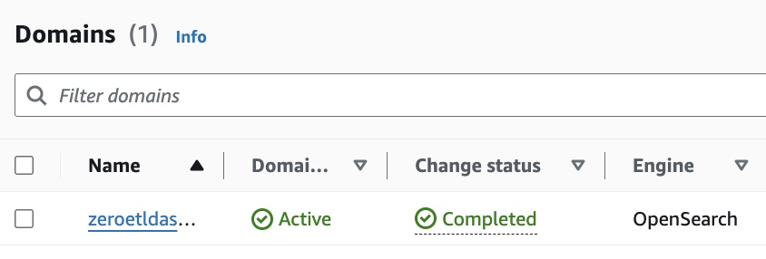
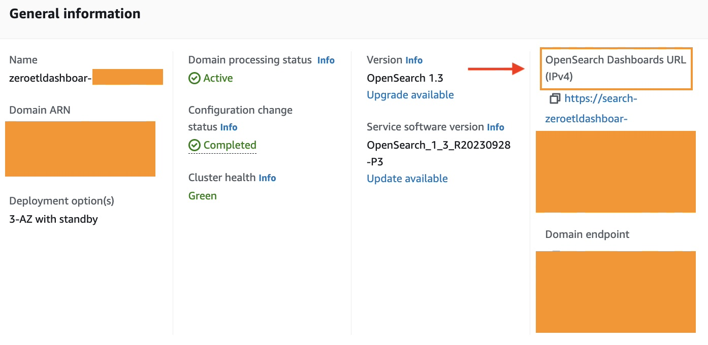

# Real-time Data Visualization with OpenSearch and Amazon DynamoDB: A Zero-ETL Pipeline

[Amazon OpenSearch](https://docs.aws.amazon.com/es_es/opensearch-service/latest/developerguide/what-is.html) Service and Amazon DynamoDB provide a powerful combination for real-time data visualization without the need for complex Extract, Transform, Load (ETL) processes. This repositorie introduces an AWS Cloud Development Kit (CDK) stack that deploys a serverless architecture for efficient, real-time data ingestion using the [OpenSearch Ingestion](https://docs.aws.amazon.com/opensearch-service/latest/developerguide/ingestion.html) service (OSIS).

By leveraging OSIS, you can process and transform data from DynamoDB streams directly into OpenSearch, enabling near-instant visualization and analysis. This zero-ETL pipeline eliminates the overhead of traditional data transformation workflows, allowing you to focus on deriving insights from your data.

The CDK stack provisions key components such as Amazon Cognito for authentication, IAM roles for secure access, an OpenSearch domain for indexing and visualization, an S3 bucket for data backups, and a DynamoDB table as the data source. OpenSearch Ingestion acts as the central component, efficiently processing data based on a declarative YAML configuration.


## Prerequisites

- [AWS Account](https://aws.amazon.com/resources/create-account/?sc_channel=el&sc_campaign=datamlwave&sc_content=cicdcfnaws&sc_geo=mult&sc_country=mult&sc_outcome=acq) 
-  [Foundational knowledge of Python](https://catalog.us-east-1.prod.workshops.aws/workshops/3d705026-9edc-40e8-b353-bdabb116c89c/)

## 💰 Cost to complete: 
- [Amazon DynamoDB Pricing](https://aws.amazon.com/dynamodb/pricing/)
- [Amazon OpenSearch Service Pricing](https://aws.amazon.com/opensearch-service/pricing/)
- [Amazon Cognito Pricing](https://aws.amazon.com/cognito/pricing/)
- [Amazon S3 Pricing](https://aws.amazon.com/s3/pricing/)

## How Does This Application Work?


The flow starts with data stored in Amazon DynamoDB, a managed and scalable NoSQL database. Then, the data is transmitted to [Amazon S3](https://docs.aws.amazon.com/es_es/AmazonS3/latest/userguide/Welcome.html).

From the data in S3, it is indexed using Amazon OpenSearch, a service that enables real-time search and analysis on large volumes of data. OpenSearch indexes the data and makes it easily accessible for fast queries.

The next component is Amazon Cognito, a service that enables user identity and access management. Cognito authenticates and authorizes users to access the OpenSearch Dashboard.

[AWS Identity and Access Management Roles](https://docs.aws.amazon.com/es_es/IAM/latest/UserGuide/id_roles.html) is used to define roles and access permissions. 

To create an OpenSearch Ingestion pipeline, you need an [IAM role that the pipeline](https://docs.aws.amazon.com/opensearch-service/latest/developerguide/creating-pipeline.html?icmpid=docs_console_unmapped#manage-pipeline-prerequisites) will assume to write data to the sink (an OpenSearch Service domain or OpenSearch Serverless collection). The role's ARN must be included in the pipeline configuration. The sink, which can be an OpenSearch Service domain (running OpenSearch 1.0+ or Elasticsearch 7.4+) or an OpenSearch Serverless collection, must have an access policy granting the necessary permissions to the IAM pipeline role. ([Granting Amazon OpenSearch Ingestion pipelines access to domains](https://docs.aws.amazon.com/opensearch-service/latest/developerguide/pipeline-domain-access.html) - [Granting Amazon OpenSearch Ingestion pipelines access to collections](https://docs.aws.amazon.com/opensearch-service/latest/developerguide/pipeline-collection-access.html)).

OpenSearch Ingestion requires [specific IAM permissions](https://docs.aws.amazon.com/opensearch-service/latest/developerguide/creating-pipeline.html?icmpid=docs_console_unmapped#create-pipeline-permissions) to create pipelines, including `osis:CreatePipeline` to create a pipeline, `osis:ValidatePipeline` to validate the pipeline configuration, and `iam:PassRole` to pass the pipeline role to OpenSearch Ingestion, allowing it to write data to the domain. The `iam:PassRole` permission must be granted on the [pipeline role resource](https://docs.aws.amazon.com/opensearch-service/latest/developerguide/pipeline-domain-access.html#pipeline-access-configure) (specified as sts_role_arn in the pipeline configuration) or set to * if different roles will be used for each pipeline.

The main link of this pipeline configuration is a [YAML file format](https://github.com/build-on-aws/realtime-dynamodb-zero-etl-opensearch-visualization/blob/main/dashboard/dashboard/template.txt) that connects the DynamoDB table with OpenSearch: 

The pipeline configuration is done through a [YAML file format](https://github.com/build-on-aws/realtime-dynamodb-zero-etl-opensearch-visualization/blob/main/dashboard/dashboard/template.txt) like:

```
version: "2"
dynamodb-pipeline:
  source:
    dynamodb:
      acknowledgments: true
      tables:
        # REQUIRED: Supply the DynamoDB table ARN and whether export or stream processing is needed, or both
        - table_arn: "DYNAMODB_TABLE_ARN"
          # Remove the stream block if only export is needed
          stream:
            start_position: "LATEST"
          # Remove the export block if only stream is needed
          export:
            # REQUIRED for export: Specify the name of an existing S3 bucket for DynamoDB to write export data files to
            s3_bucket: "<<my-bucket>>"
            # Specify the region of the S3 bucket
            s3_region: "<<REGION_NAME>"
            # Optionally set the name of a prefix that DynamoDB export data files are written to in the bucket.
            s3_prefix: "ddb-to-opensearch-export/"
      aws:
        # REQUIRED: Provide the role to assume that has the necessary permissions to DynamoDB, OpenSearch, and S3.
        sts_role_arn: "<<STS_ROLE_ARN>>"
        # Provide the region to use for aws credentials
        region: "<<REGION_NAME>>"
  sink:
    - opensearch:
        # REQUIRED: Provide an AWS OpenSearch endpoint
        hosts:
          [
            "<<https://OpenSearch_DOMAIN>>"
          ]
        index: "<<table-index>>"
        index_type: custom
        document_id: "${getMetadata(\"primary_key\")}"
        action: "${getMetadata(\"opensearch_action\")}"
        document_version: "${getMetadata(\"document_version\")}"
        document_version_type: "external"
        aws:
          # REQUIRED: Provide a Role ARN with access to the domain. This role should have a trust relationship with osis-pipelines.amazonaws.com
          sts_role_arn: "<<STS_ROLE_ARN>>"
          # Provide the region of the domain.
          region: "<<REGION_NAME>>"
```
The pipeline configuration file is automatically created in the CDK stack along with all the other resources.

## Let's build!

### Step 1:  APP Set Up 

✅ **Clone the repo**

```
git clone https://github.com/build-on-aws/realtime-dynamodb-zero-etl-opensearch-visualization
```

✅ **Go to**: 

```
cd dashboard
```

- Configure the [AWS Command Line Interface](https://docs.aws.amazon.com/cli/latest/userguide/cli-chap-configure.html)

- Deploy architecture with CDK [Follow steps:](https://github.com/build-on-aws/realtime-dynamodb-zero-etl-opensearch-visualization/blob/main/dashboard/README.md)

✅ **Create The Virtual Environment**: by following the steps in the [README](https://github.com/build-on-aws/realtime-dynamodb-zero-etl-opensearch-visualization/blob/main/dashboard/README.md)

```
python3 -m venv .venv
```

```
source .venv/bin/activate
```
for windows: 

```
.venv\Scripts\activate.bat
```

✅ **Install The Requirements**:

```
pip install -r requirements.txt
```

✅ **Synthesize The Cloudformation Template With The Following Command**:

```
cdk synth
```

✅🚀 **The Deployment**:

```
cdk deploy
```

The deployment will take between 5 and 10 minutes, which is how long it takes for the OpenSearch domain to be created.

When it is ready you will see that the status changes to completed:



To access the OpenSearch Dashboards through the [OpenSearch Dashboards URL (IPv4)](https://docs.aws.amazon.com/opensearch-service/latest/developerguide/dashboards.html) you need to [create a user in the Amazon Cognito user pools](https://docs.aws.amazon.com/cognito/latest/developerguide/managing-users.html?icmpid=docs_cognito_console_help_panel).



With the created user, access the Dashboard and begin to experience the magic of Zero-ETL between the DynamoDB table and OpenSearch.

In this repository you created a table to which you can inject data, but you can also change it by [Updating Amazon OpenSearch Ingestion pipelines](https://docs.aws.amazon.com/opensearch-service/latest/developerguide/update-pipeline.html) making a change to the YAML file or modifying the [CDK stack](https://github.com/build-on-aws/realtime-dynamodb-zero-etl-opensearch-visualization/blob/main/dashboard/dashboard/dashboard_stack.py).

## Conclusion

The combination of Amazon OpenSearch and Amazon DynamoDB enables real-time data visualization without the complexities of traditional ETL processes. By utilizing the OpenSearch Ingest Service (OSIS), a serverless architecture can be implemented that efficiently processes and transforms data from DynamoDB directly into OpenSearch. Building the application with AWS CDK streamlines and simplifies the setup of key components such as authentication, secure access, indexing, visualization, and data backup.

This solution allows users to focus on gaining insights from their data rather than managing infrastructure. Ideal for real-time dashboards, log analytics, or IoT event monitoring, this Zero-ETL pipeline offers a scalable and agile approach to data ingestion and visualization. It is recommended to clone the repository, customize the configuration, and deploy the stack on AWS to leverage the power of OpenSearch and DynamoDB for real-time data visualization.


## Security

See [CONTRIBUTING](CONTRIBUTING.md#security-issue-notifications) for more information.

## License

This library is licensed under the MIT-0 License. See the LICENSE file.

